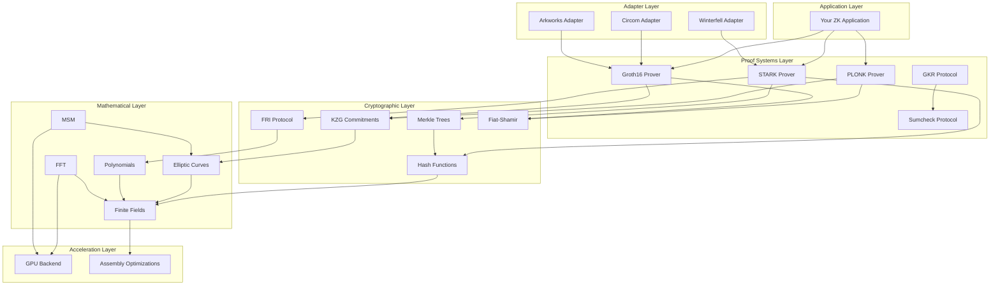
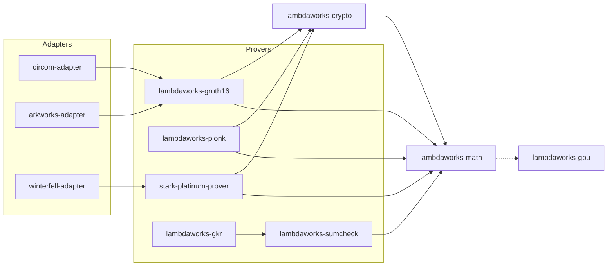
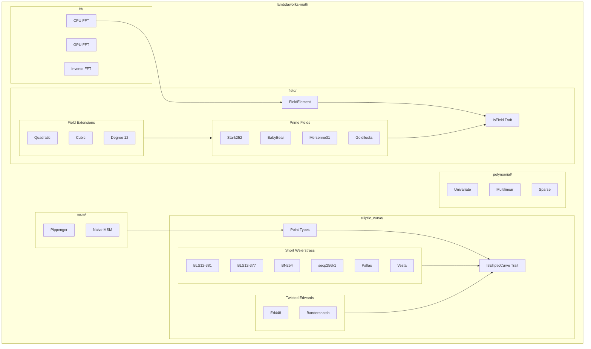
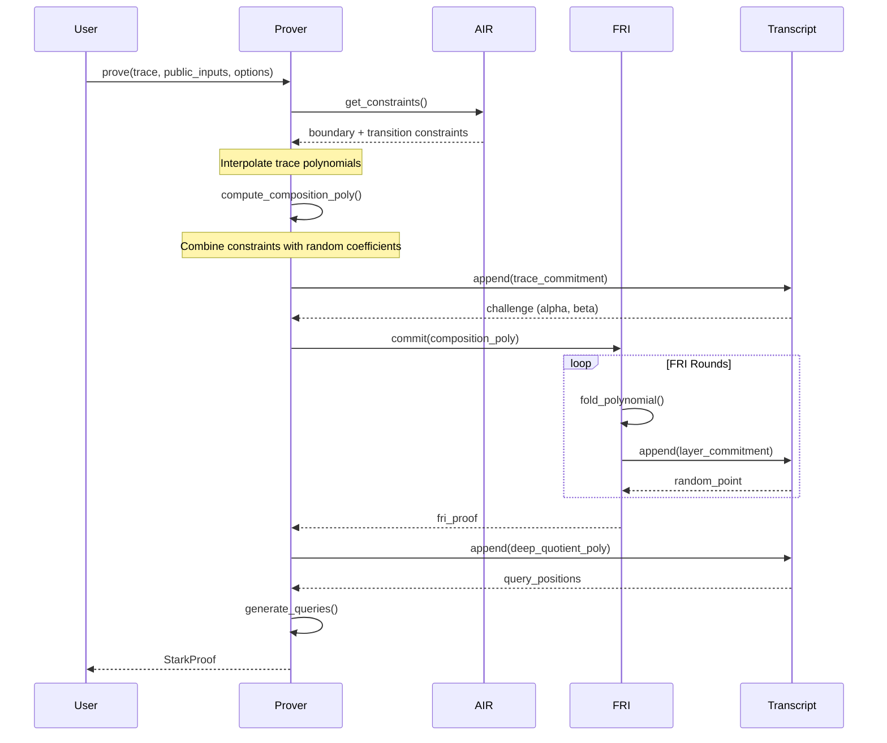
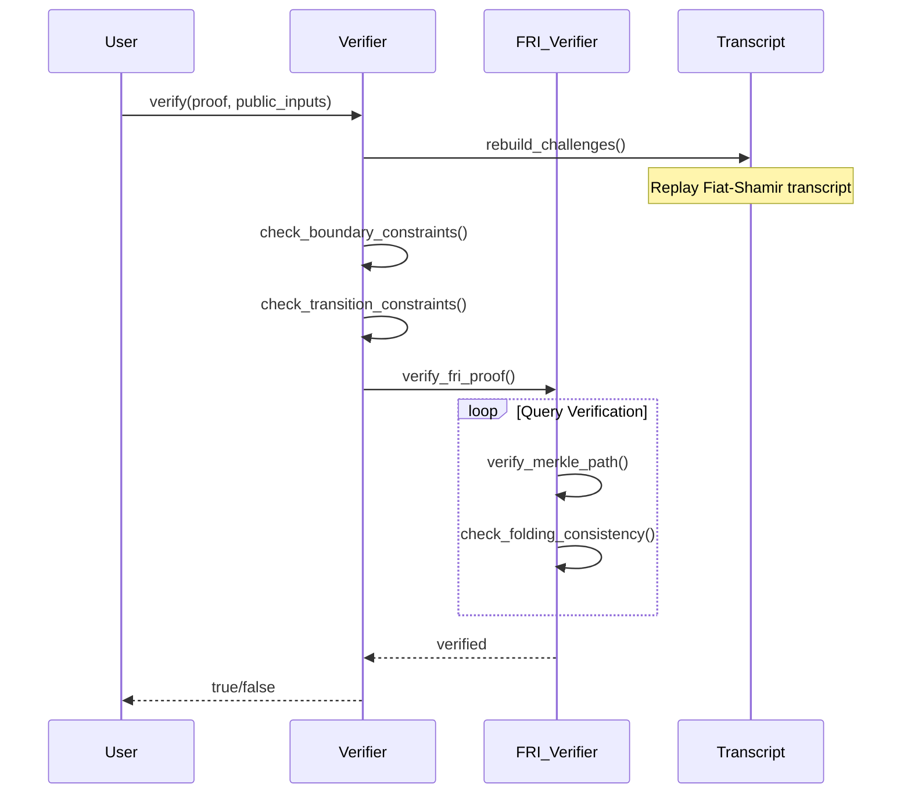
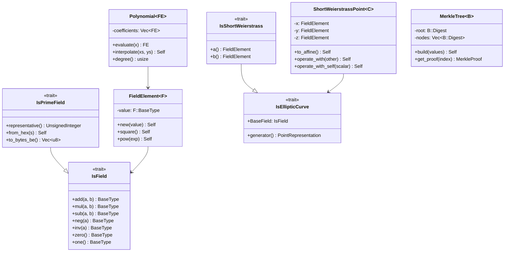
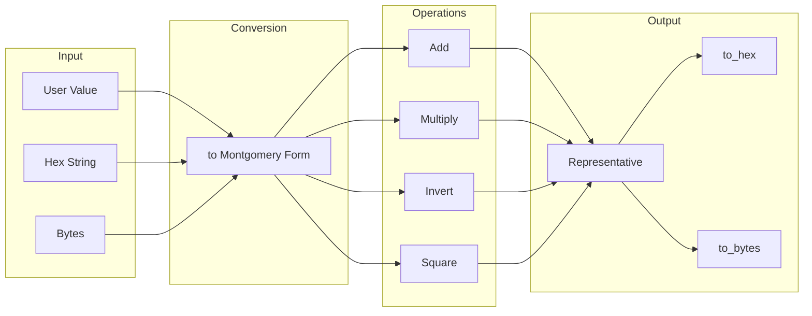
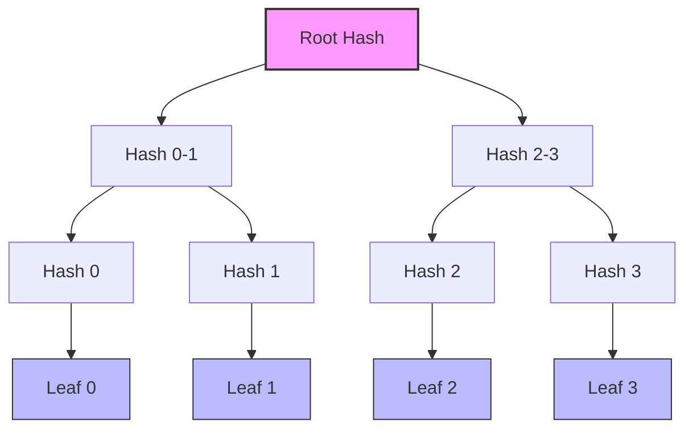
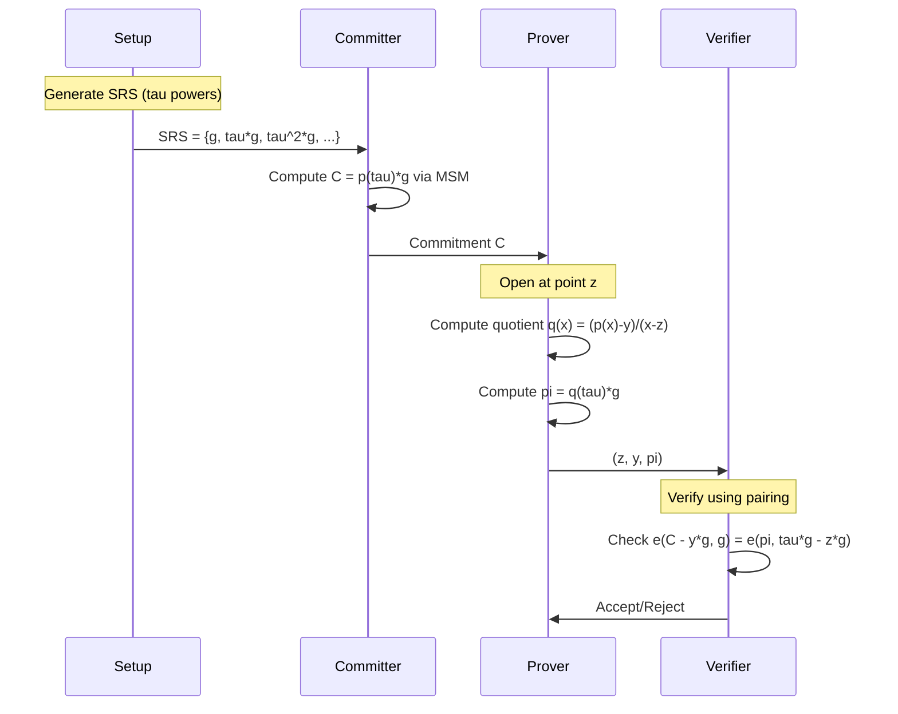

# Architecture Diagrams

This page contains visual diagrams explaining lambdaworks' architecture, data flows, and component relationships.

## High-Level Architecture

The following diagram shows the layered architecture of lambdaworks:



## Crate Dependency Graph

This diagram shows the dependency relationships between lambdaworks crates:



## Math Module Structure

Detailed view of the `lambdaworks-math` crate organization:



## STARK Prover Flow

Sequence diagram showing the STARK proof generation process:



## Proof Verification Flow



## Type Hierarchy

Class diagram showing the main type relationships:



## Proving System Comparison

Comparison of the three main proving systems:

```mermaid
graph TB
    subgraph STARK_System["STARK"]
        STARK_AIR[AIR Definition]
        STARK_TRACE[Execution Trace]
        STARK_FRI[FRI Commitment]
        STARK_HASH[Hash-based]

        STARK_AIR --> STARK_TRACE
        STARK_TRACE --> STARK_FRI
        STARK_FRI --> STARK_HASH
    end

    subgraph PLONK_System["PLONK"]
        PLONK_CIRCUIT[Circuit Definition]
        PLONK_GATES[Gate Constraints]
        PLONK_KZG[KZG Commitment]
        PLONK_PAIRING[Pairing-based]

        PLONK_CIRCUIT --> PLONK_GATES
        PLONK_GATES --> PLONK_KZG
        PLONK_KZG --> PLONK_PAIRING
    end

    subgraph Groth16_System["Groth16"]
        G16_R1CS[R1CS Circuit]
        G16_QAP[QAP Transform]
        G16_TRUSTED[Trusted Setup]
        G16_PAIRING[Pairing-based]

        G16_R1CS --> G16_QAP
        G16_QAP --> G16_TRUSTED
        G16_TRUSTED --> G16_PAIRING
    end
```



## Data Flow: Field Element Operations



## Merkle Tree Structure



## KZG Commitment Scheme Flow



## Using These Diagrams

These diagrams are written in Mermaid syntax and can be rendered in:

1. **GitHub**: Automatically renders Mermaid in Markdown files.
2. **mdBook**: Use the `mdbook-mermaid` preprocessor.
3. **VS Code**: Install the Mermaid extension for preview.
4. **Online**: Use [mermaid.live](https://mermaid.live) for editing and export.

To add Mermaid support to your mdBook, add to `book.toml`:

```toml
[preprocessor.mermaid]
command = "mdbook-mermaid"

[output.html]
additional-js = ["mermaid.min.js", "mermaid-init.js"]
```
