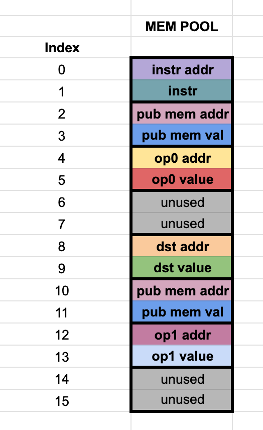
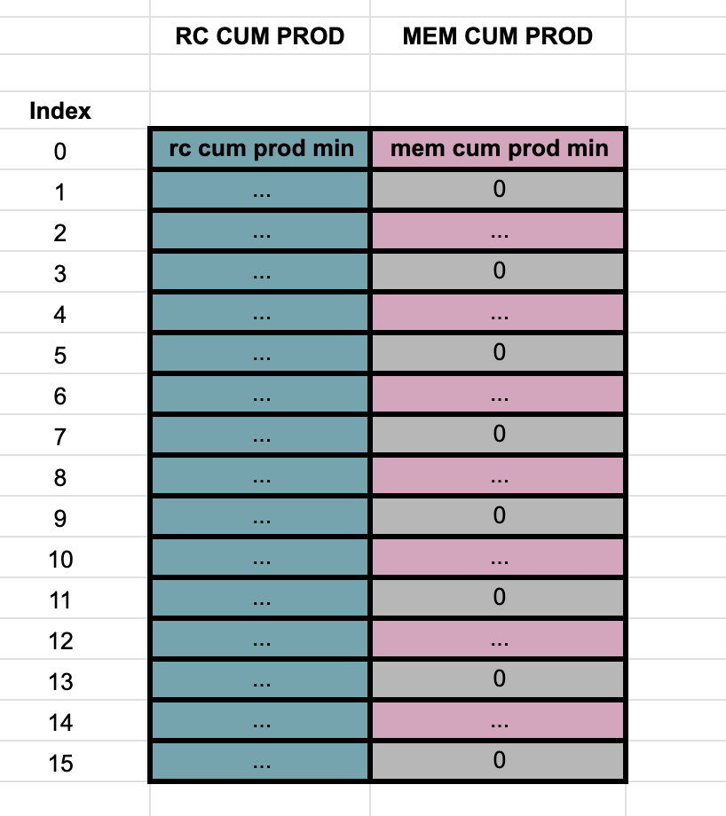

# Stone prover trace - Layout plain
For a Cairo program executed in **N** steps, the stone prover trace with the *plain* layout configuration is a table of **16xN** rows and **8** columns. 

From the 8 columns, 6 are built directly from the register states and memory, while the 2 other are built from the interaction phase with the verifier.

For every step or cycle of the Cairo VM, the trace cells representing its state are arranged along 16 rows.
This means that the subtable from row 0 to 15 has all trace cells representing the VM state at step 0, the trace cells from 16 to 31 the state at step 1, and so on.

The implementation details of the trace for this layout can be found in the Stone source code, [cpu_air_definition10.h](https://github.com/starkware-libs/stone-prover/blob/main/src/starkware/air/cpu/board/cpu_air_definition10.h) and [cpu_air_definition10.inl](https://github.com/starkware-libs/stone-prover/blob/main/src/starkware/air/cpu/board/cpu_air_definition10.inl).

## Columns & virtual columns
In simple terms, a **virtual column** is just a subset of rows of a real column.
Virtual columns are broadly defined by three parameters:
* The *real* column they are a subset of.
* The step. Given an element of the virtual column, this value specifies the number of rows you have to move to find the next element of the virtual column.
* The row offset. Basically the number of rows you have to move in the *real* column to find the first element of the virtual column.

For a single step or cycle, the *main* trace can be visualized like the following. Note that it is missing the two additional *interaction columns*:


This representation will be useful for the explanation of each column and virtual column.

# Main trace columns

## Column 0 - rc pool
This column is made up of trace cells that need to be range checked, hence the name. While they all have to satisfy this constraint, there are three virtual columns embedded in this column, each one having its own additional constraint. The three of them are associated with the offsets found in each Cairo instruction, **off_dst**, **off_op0** and **off_op1**, as they appear in the [Cairo whitepaper](https://eprint.iacr.org/2021/1063.pdf), section 4.4.
* **off0 (off_dst)** - step 16, row offset 0.
* **off1 (off_op1)** - step 16, row offset 8.
* **off2 (off_op0)** - step 16, row offset 4.

As it can be seen, there are plenty of unused cells in this column (rows 1, 2, 3, 5, 6, 7, 8, 10, 11, 12, 13, 14 and 15). Since there is a continuity constraint in this column, the should be no holes in their values, so the unused cells are used to fill the value holes. As holes are found, they are filled in ascending order in these cells.
Since there can't be missing values in the trace, these cells have to be filled with something that doesn't break the constraints. When there are no more value holes to fill, the remaining unused cells are filled with the **rc max** value (although any value given by the offsets would do the trick, since we only check they are in a certain range, but this is the way it is done in Stone).

As an example, consider that the values in this column are 2, 4 and 5. We would insert the value 3 in the first available unused cell at row 1, and then fill all the other unused cells with the value 5 until the end of the trace.

For reference, check [range_check_cell.h](https://github.com/starkware-libs/stone-prover/blob/main/src/starkware/air/components/perm_range_check/range_check_cell.h) and [range_check_cell.inl](https://github.com/starkware-libs/stone-prover/blob/main/src/starkware/air/components/perm_range_check/range_check_cell.inl).


## Column 1 - flags (decode/opcode rc)
This is the column in charge of holding the flags configuration of each executed Cairo instruction. As a quick summary, each Cairo instruction has 15 bit of flags. The constraint over these 15 bits is that they are in fact bits, so only 0 or 1 are allowed. Mathematically, this means that $f_i * (f_i - 1) = 0$, for $i$ in $(0, 14)$, while $f_{15} = 0$ always.
As can be seen in the [Cairo whitepaper](https://eprint.iacr.org/2021/1063.pdf) section 9.4, we can define

$\tilde{f_{i}} = \sum_{j=i}^{14}2^{j-i} f_i$

so that $\tilde{f_{0}}$ is the full 15 bit value and $\tilde{f_{15}} = 0$. This way, instead of allocating 15 virtual columns for each flag, we can allocate one of lenght 16 (for each step of the Cairo execution), with the values $\tilde{f_{i}}$. **These are the actual values that appear on the Stone prover trace, rather than the 0s or 1s.**

Noting that $\tilde{f_{i}} - 2\tilde{f}_{i+1} = f_i$, we get that the constraint over this virtual column becomes

$(\tilde{f_{i}} - 2\tilde{f}_{i+1})(\tilde{f_{i}} - 2\tilde{f}_{i+1} - 1) = 0$.

## Column 2 - sorted rc (rc16/sorted)
Pretty straightforward. This column has the same as the ones in column 0 but sorted in ascending order.

## Column 3 - mem pool

All trace cells that reflect state of the Cairo VM memory can be found here. They are two main virtual columns:
* **memory addresses** - step 2, row offset 0.
* **memory values** - step 2, row offset 1.

Each one has, at the same time, virtual *sub-columns*. In essence, this just means that in addition to the constraints that memory cells must hold, some of these memory cells have additional constraints.
To visualize them better, here is a more detailed diagram of the column:



The virtual sub-columns are
* **instruction addr** - step 16, row offset 0. The address of the instruction executed in the current step. In other words, the content of the **pc** register
* **instruction value** - step 16, row offset 1. The actual encoded instruction pointed by the instruction address.
* **dst addr** - step 16, row offset 8. The address of **dst**.
* **dst value** - step 16, row offset 9. The actual value of **dst**.
* **op0 addr** - step 16, row offset 4. The address of **op0**.
* **op0 value** - step 16, row offset 5. The actual value of **op0**.
* **op1 addr** - step 16, row offset 12. The address of **op1**.
* **op1 value** - step 16, row offset 13. The actual value of **op1**.
* **pub memory addr** - step 8, row offset 2. Address of a public memory cell
* **pub memory value** - step 8, row offset 3. Value of a public memory cell.

The public memory address and value in this column are actually always $(0, 0)$. In other words, these are the *dummy memory accesses* that are added to the trace.
For a Cairo program with a number $M$ of instructions, there should be *at least* $M$ dummy memory accesses inserted. As can be seen, there are 2 dummy accesses inserted in each trace step, since the total rows in a step is 16 and the step of the public memory virtual sub-column is 8.
This means that we need at least $M/2$ steps to fit the necessary public memory cells. In usual Cairo programs, this is achieved easily.

### Unused cells in mem pool
If we analyze the rows used by virtual sub-columns in the mem pool, we see there are 4 cells left unused in row offsets 6, 7, 14 and 15.
Since the constraints in the memory require addresses to be continuous, these unused cells are used to fill any memory holes found in the range of the accessed addresses. 
As memory holes are found, they are inserted in these empty cells in ascending order, with the address of the hole and a 0 in its corresponding value.
As an example, the first memory hole address will be inserted in row 6 and the value 0 will be inserted at row 7. The next memory hole will be filled in rows 14 and 15, while the next memory hole would be filled in rows 22 and 23, etc.
An important detail is that the last accessed address + 1 will always appear as a memory hole. This means that once all gaps are filled, the (max address + 1, 0) entry will appear in all these unused cells, until the end of the trace. In particular, if the memory didn't have any hole, this will be the only value that will be appear in these unused cells.
For reference, check [memory_cell](https://github.com/starkware-libs/stone-prover/blob/main/src/starkware/air/components/memory/memory_cell.h).h and [memory_cell.inl](https://github.com/starkware-libs/stone-prover/blob/main/src/starkware/air/components/memory/memory_cell.inl).

## Column 4 - sorted mem pool
The same values as column 3, but the (address, value) pairs get sorted by their address, in ascending order, but there is no $(0, 0)$ accesses here. 
The dummy memory accesses are replaced by the real public memory values, repeating the first **(pub addr, pub value)** until all the dummy accesses are replaced.
For example, if the public memory is:

```
        (1, 4334524)
        (2, 3252643)
        (3, 3245444)
```

and the total dummy accesses are (in total, one more than the actual publc memory):
```
        (0, 0)
        (0, 0)
        (0, 0)
        (0, 0)
```

the final result in the sorted column will be
```
        (1, 4334524)
        (1, 4334524)
        (2, 3252643)
        (3, 3245444)
```

## Column 5 - registers / pc update
This column is used to store the values of the **ap** and **fp** registers, the **res** value and some values used as an optimization, **t0*
*, **t1** and **ops_mul** related to the update of the **pc** register. Each one has a corresponding virtual column:
* **ap** - step 16, row offset 0.
* **fp** - step 16, row offset 8.
* **ops_mul** - step 16, row offset 4.
* **res** - step 16, row offset 12.
* **tmp0** - step 16, row offset 2.
* **tmp1** - step 16, row offset 10.

# Interaction trace columns
As these columns are built from an interaction with the verifier, the values found here are not deterministic.
The interaction trace columns can be visualized with the following table:



## Column 6 - range check cumulative product
The details about how this column is built can be found in the [Cairo whitepaper](https://eprint.iacr.org/2021/1063.pdf), sections 9.4 and 9.9. In summary, just the cumulative product to prove the permutation between the the rc pool and the sorted rc pool.

## Column 7 - multi column permutation cum product
Similarly to column 6, the details of how this column is built is referred to sections 9.7 and 9.8 of the whitepaper.
The only relevant detail is that this cumulative product is in fact a virtual column, with step 2 and row offset 0. All the other values in this column (step 2 and row offset 1) are unused and filled with 0s.